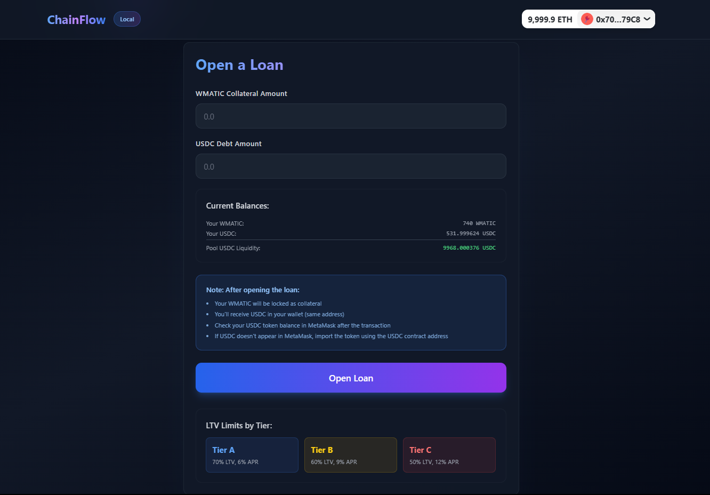
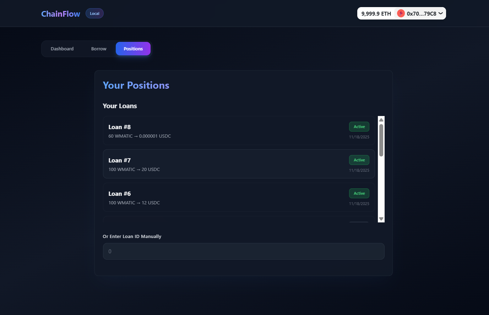

# 🚀 ChainFlow — AI-Powered DeFi Lending Platform

<div align="center">


**Blending AI Credit Scoring with On-Chain Lending for Capital-Efficient DeFi**

[](https://opensource.org/licenses/MIT)
[](https://www.typescriptlang.org/)
[](https://soliditylang.org/)
[](https://reactjs.org/)

[Features](#-features) • [Architecture](#-architecture) • [Quick Start](#-quick-start) • [Documentation](#-documentation) • [Demo](#-demo)

</div>

---

## 📖 Overview

**ChainFlow** is a next-generation DeFi lending platform that leverages AI-powered credit scoring to reduce collateral requirements while maintaining full transparency and decentralization. Unlike traditional DeFi protocols that require 150-200% collateral, ChainFlow enables borrowers with good credit scores to access loans at 110-130% collateral ratios.

### 🎯 Problem Statement

- **Traditional Finance (TradFi)** credit scores are opaque, centralized, and exclude users without formal credit history
- **Current DeFi Lending** is over-collateralized (150-200%), making it capital-inefficient
- **ChainFlow Solution**: AI-driven on-chain credit scoring that enables lower collateral ratios for creditworthy borrowers

### ✨ Key Innovations

- 🤖 **AI-Powered Credit Scoring**: Machine learning model analyzes on-chain wallet activity
- 🔐 **Privacy-Preserving**: Only score hashes stored on-chain, raw scores remain private
- ⛓️ **Fully Decentralized**: Smart contracts handle all lending logic
- 📊 **Dynamic Terms**: Loan-to-value (LTV) and APR adjust based on credit tier
- 🔗 **Oracle Integration**: Chainlink price feeds ensure accurate collateral valuation

---

## 🎨 UI Screenshots

> **Note**: Add your UI screenshots here to showcase the modern, polished interface

### Dashboard
<!--  -->
*Credit score visualization, tier badges, and score signals*

### Borrow Interface
<!--  -->
*Live LTV calculator, collateral input, and loan opening flow*

### Positions View
<!--  -->
*Loan details, health factor monitoring, and repayment interface*

---

## 🚀 Features

### Core Functionality

- ✅ **AI Credit Scoring (A/B/C Tiers)**
  - Analyzes wallet age, transaction history, stablecoin holdings, and loan repayment history
  - Score computed using ML model with feature engineering and normalization
  - Score hash committed to on-chain registry for transparency

- ✅ **Collateralized Lending**
  - Borrow USDC using WMATIC as collateral
  - Dynamic LTV limits based on credit tier (A: 70%, B: 60%, C: 50%)
  - Tier-based APR (A: 6%, B: 9%, C: 12%)

- ✅ **Health Factor Monitoring**
  - Real-time health factor calculation using Chainlink price feeds
  - Automatic liquidation when HF < 1.0
  - Visual indicators for loan health status

- ✅ **Modern Web Interface**
  - Glassmorphism design with gradient accents
  - Responsive layout with smooth animations
  - Wallet integration via MetaMask/RainbowKit
  - Real-time transaction status updates

- ✅ **Smart Contract Security**
  - OpenZeppelin contracts for battle-tested security
  - Reentrancy guards on all state-changing functions
  - Safe ERC20 token transfers
  - Access control via Ownable pattern

---

## 🏗️ Architecture

### System Components

```
┌─────────────────┐
│   React Frontend │  ← User Interface (wagmi, RainbowKit)
│   (web/)        │
└────────┬────────┘
         │
         ├─────────────────┐
         │                 │
┌────────▼────────┐  ┌─────▼──────┐
│  Express API   │  │  Smart     │
│  (api/)        │  │  Contracts │
│                │  │  (contracts/)│
│  - Scoring     │  │             │
│  - Score Commit│  │  - LendingCore│
└────────────────┘  │  - CollateralVault│
                    │  - CreditScoreRegistry│
                    │  - PriceOracleRouter│
                    └────────────────────┘
                              │
                              ▼
                    ┌─────────────────┐
                    │  Chainlink      │
                    │  Price Feeds    │
                    └─────────────────┘
```

### Smart Contract Architecture

#### 1. **CreditScoreRegistry**
- Stores credit score hashes and tiers for each user
- Only whitelisted scorer (API wallet) can set scores
- Provides `getTier(address)` for contract queries

#### 2. **PriceOracleRouter**
- Wraps Chainlink aggregator interface
- Normalizes prices to 1e18 format
- Provides latest price for collateral valuation

#### 3. **CollateralVault**
- Holds all collateral tokens in escrow
- Owner-only withdrawals (LendingCore)
- Releases collateral to borrower upon loan closure

#### 4. **LendingCore** (Main Contract)
- **`openLoan(collateral, desiredDebt)`**: Opens new loan after tier/LTV checks
- **`repay(id, amount)`**: Processes repayments, releases collateral when debt = 0
- **`healthFactor(id)`**: Calculates HF using latest oracle price
- **`liquidate(id, repayAmount)`**: Allows liquidation when HF < 1.0

### Credit Tier System

| Tier | LTV Limit | APR | Description |
|------|-----------|-----|-------------|
| **A** | 70% | 6% | Excellent credit score (80-100) |
| **B** | 60% | 9% | Good credit score (60-79) |
| **C** | 50% | 12% | Fair credit score (0-59) |

---

## 🚀 Quick Start

### Prerequisites

- **Node.js** 20+ (check `.nvmrc` for exact version)
- **MetaMask** browser extension
- **Git** for cloning the repository
- **WalletConnect Project ID** ([Get one here](https://cloud.walletconnect.com))

### Installation

1. **Clone the repository**
   ```bash
   git clone https://github.com/yourusername/chainflow.git
   cd chainflow
   ```

2. **Install dependencies**
   ```bash
   # Install for all packages
   cd contracts && npm install
   cd ../api && npm install
   cd ../web && npm install
   ```

3. **Configure environment variables**

   **Contracts** (`contracts/.env`):
   ```env
   POLYGON_AMOY_RPC_URL=https://rpc-amoy.polygon.technology
   DEPLOYER_PRIVATE_KEY=your_private_key_here
   WMATIC_ADDRESS=0x9c3C9283D3e44854697Cd22D3Faa240Cfb032889
   USDC_ADDRESS=0x41E94Eb019C0762f9Bfcf9FB1f58726b5F5D96C5
   CHAINLINK_MATIC_USD=0xd0D5e3DB44DE05E9F294BB0a3bEEaF030DE24Ada
   ```

   **API** (`api/.env`):
   ```env
   PORT=4000
   RPC_URL=https://rpc-amoy.polygon.technology
   PRIVATE_KEY=your_api_wallet_private_key_here
   SCORE_REGISTRY_ADDRESS=0x... # After deployment
   LENDING_CORE_ADDRESS=0x... # After deployment
   USDC_ADDRESS=0x41E94Eb019C0762f9Bfcf9FB1f58726b5F5D96C5
   ```

   **Web** (`web/.env.local`):
   ```env
   VITE_API_URL=http://localhost:4000
   VITE_CORE_ADDRESS=0x... # After deployment
   VITE_SCORE_ADDRESS=0x... # After deployment
   VITE_WMATIC_ADDRESS=0x9c3C9283D3e44854697Cd22D3Faa240Cfb032889
   VITE_USDC_ADDRESS=0x41E94Eb019C0762f9Bfcf9FB1f58726b5F5D96C5
   VITE_WALLETCONNECT_PROJECT_ID=your_project_id_here
   ```

4. **Deploy contracts**
   ```bash
   cd contracts
   npm run compile
   npm run deploy:amoy
   ```
   
   **Important**: Save the deployed contract addresses and update your `.env` files!

5. **Fund LendingCore with USDC**
   - Transfer USDC tokens to the deployed `LendingCore` contract address
   - This provides liquidity for loans

6. **Start the application**
   ```bash
   # Terminal 1: Start API
   cd api
   npm run dev
   
   # Terminal 2: Start Web App
   cd web
   npm run dev
   ```

7. **Open in browser**
   - Navigate to `http://localhost:5173`
   - Connect your MetaMask wallet
   - Ensure you're on Polygon Amoy testnet

---

## 🧪 Local Development (Hardhat Network)

Perfect for demos and testing without testnet tokens!

### Quick Setup

1. **Start Hardhat Node** (Terminal 1):
   ```bash
   cd contracts
   npm run node
   ```
   Keep this running! Note the account addresses and private keys.

2. **Deploy & Setup** (Terminal 2):
   ```bash
   cd contracts
   npm run setup:demo
   ```
   This automatically:
   - Deploys mock WMATIC and USDC tokens
   - Deploys all contracts
   - Mints 1000 WMATIC to borrower account
   - Mints 500 USDC to borrower account
   - Funds LendingCore with 10,000 USDC

3. **Configure MetaMask**:
   - Add network: `http://127.0.0.1:8545`, Chain ID: `31337`
   - Import Account #1 (borrower) using private key from Hardhat output

4. **Update Environment Variables**:
   - `api/.env`: Set `RPC_URL=http://127.0.0.1:8545` and contract addresses
   - `web/.env.local`: Set contract addresses from deployment output

5. **Start Services**:
   ```bash
   # Terminal 3: API
   cd api && npm run dev
   
   # Terminal 4: Web
   cd web && npm run dev
   ```

### What You Get

- ✅ Pre-funded accounts (10,000 ETH each)
- ✅ Mock tokens (WMATIC, USDC) minted automatically
- ✅ All contracts deployed and configured
- ✅ Ready for demo immediately!

---

## 📚 Documentation

### Project Structure

```
chainflow/
├── contracts/          # Hardhat Solidity contracts
│   ├── contracts/      # Smart contract source files
│   ├── scripts/        # Deployment and setup scripts
│   ├── test/           # Contract tests
│   └── hardhat.config.ts
├── api/                # Express/TypeScript scoring API
│   ├── src/
│   │   ├── index.ts    # API server entry point
│   │   └── scoring/    # Credit scoring logic
│   │       ├── signals.ts    # On-chain data collection
│   │       ├── ml-model.ts  # ML scoring model
│   │       └── score.ts     # Score computation & commitment
│   └── package.json
├── web/                # React frontend application
│   ├── src/
│   │   ├── pages/      # Dashboard, Borrow, Positions
│   │   ├── components/ # Reusable UI components
│   │   └── lib/        # Contract ABIs, wagmi config
│   └── package.json
└── README.md
```

### API Endpoints

- `GET /score/:address` - Fetch credit score and tier for an address
- `POST /score/commit` - Commit score hash to on-chain registry

### Smart Contract Functions

**LendingCore**:
- `openLoan(uint256 collateralAmount, uint256 desiredDebt)` - Open a new loan
- `repay(uint256 loanId, uint256 amount)` - Repay loan debt
- `healthFactor(uint256 loanId)` - Get current health factor
- `liquidate(uint256 loanId, uint256 repayAmount)` - Liquidate unhealthy loan

**CreditScoreRegistry**:
- `setScoreHash(address user, bytes32 scoreHash, uint8 tier)` - Set user's credit tier
- `getTier(address user)` - Get user's credit tier

---

## 🎯 Usage Guide

### 1. Connect Wallet
- Click "Connect Wallet" button
- Select MetaMask from the options
- Approve connection request
- Ensure you're on the correct network (Polygon Amoy or Local)

### 2. View Credit Score
- Navigate to **Dashboard** tab
- Your credit score and tier will be displayed
- View detailed score signals (wallet age, transactions, stablecoin holdings, loan history)
- Score refreshes once per day (24-hour limit)

### 3. Commit Score
- Navigate to **Borrow** tab
- If score not committed, click "Commit Score" button
- Approve transaction in MetaMask
- Wait for confirmation
- **Note**: This is a one-time action per wallet

### 4. Open a Loan
- In **Borrow** tab, enter:
  - **WMATIC Collateral Amount** (e.g., 100)
  - **USDC Debt Amount** (e.g., 50)
- Watch the **live LTV bar** update in real-time
- Ensure LTV is within your tier's limit
- Click "Open Loan"
- Approve WMATIC spending if prompted
- Confirm transaction in MetaMask
- **Success**: You'll receive USDC in your wallet!

### 5. View Position
- Navigate to **Positions** tab
- Your loans are automatically listed, or enter **Loan ID** manually
- View loan details:
  - Borrower address and tier
  - Collateral and debt amounts
  - Current debt (with accrued interest)
  - Interest rate and dates
  - Health factor status

### 6. Repay Loan
- In **Positions** tab, enter **Repay Amount** in USDC
- Click "Repay Max" to repay full debt, or enter custom amount
- Click "Repay"
- Approve USDC spending if needed
- Confirm transaction
- **Note**: Collateral is automatically released when debt reaches zero

---

## 🔒 Security Features

- ✅ **OpenZeppelin Contracts**: Battle-tested security patterns
- ✅ **Reentrancy Guards**: Protection against reentrancy attacks
- ✅ **Safe ERC20**: Secure token transfer handling
- ✅ **Access Control**: Ownable pattern for admin functions
- ✅ **Oracle Security**: Chainlink price feeds for reliable data
- ✅ **Input Validation**: Comprehensive checks on all user inputs

### Security Considerations

⚠️ **This is a demo/prototype project**. For production use:
- Conduct formal security audit
- Implement additional access controls
- Add circuit breakers and pause mechanisms
- Consider multi-sig for admin functions
- Implement rate limiting on API

---

## 🛠️ Development

### Running Tests

```bash
# Contract tests
cd contracts
npm test

# Run specific test file
npm test -- LendingCore.test.ts
```

### Building for Production

```bash
# Build frontend
cd web
npm run build

# Output will be in web/dist/
```

### Code Style

- **Solidity**: Follow [Solidity Style Guide](https://docs.soliditylang.org/en/latest/style-guide.html)
- **TypeScript**: ESLint + Prettier configured
- **React**: Functional components with hooks

---

## 🐛 Troubleshooting

### Common Issues

**"Insufficient funds for gas"**
- Ensure your wallet has MATIC for gas fees
- For testnet, use [Polygon Faucet](https://faucet.polygon.technology/)

**"Score can only be refreshed once per day"**
- This is by design to prevent API abuse
- Wait 24 hours or use a different wallet for testing

**"Failed to commit score"**
- Ensure API wallet has MATIC for gas
- Check `SCORE_REGISTRY_ADDRESS` is correct in API `.env`
- Verify API wallet is whitelisted as scorer

**"Contract not found" or "Invalid address"**
- Verify contract addresses in `web/.env.local` match deployed addresses
- Ensure contracts are deployed to the correct network
- Check network ID matches (Polygon Amoy: 80002, Local: 31337)

**"Network mismatch"**
- Ensure MetaMask is on Polygon Amoy (Chain ID: 80002)
- For local development: use Hardhat network (Chain ID: 31337)
- Check `web/src/lib/wagmi.ts` for network configuration

**"Transaction reverted"**
- Check console for detailed error messages
- Verify you have sufficient token balances
- Ensure approvals are completed before loan/repay operations
- Check LTV limits for your tier

---

## 🚧 Limitations & Future Work

### Current Limitations

- Simple interest calculation (for demo clarity)
- Single collateral/debt pair (WMATIC/USDC)
- ML model is simulated (MVP version)
- Not audited (demo contracts)
- Single network support (Polygon Amoy)

### Planned Enhancements

- 🔄 Multi-asset support (multiple collateral types)
- 🤖 Production ML scoring model integration
- 📊 Subgraph for on-chain analytics
- 🎛️ Admin dashboard for parameter adjustment
- 🔐 Formal security audit
- 🌐 Multi-chain deployment
- 📈 Advanced analytics and reporting
- 🎨 Enhanced UI/UX features

---

## 📄 License

This project is licensed under the MIT License - see the [LICENSE](LICENSE) file for details.

---

## 🤝 Contributing

Contributions are welcome! Please feel free to submit a Pull Request.

1. Fork the repository
2. Create your feature branch (`git checkout -b feature/AmazingFeature`)
3. Commit your changes (`git commit -m 'Add some AmazingFeature'`)
4. Push to the branch (`git push origin feature/AmazingFeature`)
5. Open a Pull Request

---

## 👥 Authors

- **Your Name** - [@yourusername](https://github.com/yourusername)

---

## 🙏 Acknowledgments

- [OpenZeppelin](https://openzeppelin.com/) for secure contract libraries
- [Chainlink](https://chain.link/) for price oracle infrastructure
- [wagmi](https://wagmi.sh/) and [RainbowKit](https://rainbowkit.com/) for wallet integration
- [Hardhat](https://hardhat.org/) for development environment

---

## 📞 Contact & Support

- **Issues**: [GitHub Issues](https://github.com/yourusername/chainflow/issues)
- **Discussions**: [GitHub Discussions](https://github.com/yourusername/chainflow/discussions)

---

<div align="center">

**Built with ❤️ for the DeFi community**

⭐ Star this repo if you find it helpful!

</div>
